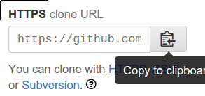
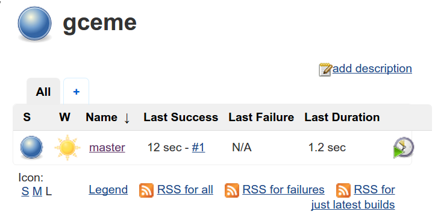
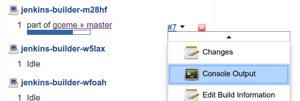

# Lab: Build a Continuouso Delivery Pipeline with Jenkins and Kubernetes

## Prerequisites
1. A GitHub account
1. A Google Cloud Platform Account

## Prework
1. Create a new Google Cloud Platform project: [https://console.developers.google.com/project](https://console.developers.google.com/project)
1. Enable the **Google Container Engine** and **Google Compute Engine** APIs
1. Install `gcloud`: [https://cloud.google.com/sdk/](https://cloud.google.com/sdk/)
1. Configure your project and zone: `gcloud config set project YOUR_PROJECT ; gcloud config set compute/zone us-central1-f`
1. Enable `kubectl`: `gcloud components update kubectl`

## Step 0
1. Clone this repository to your workstation:

  ```shell
  $ git clone https://github.com/evandbrown/jenkins-kube-cd.git
  ```

##  Create a Kubernetes Cluster
You'll use Google Container Engine to create and manage your Kubernetes cluster. Start by setting an env var with the cluster name, then provisioning it with `gcloud`:


```shell
$ gcloud container clusters create gtc \
--scopes "https://www.googleapis.com/auth/projecthosting,https://www.googleapis.com/auth/devstorage.full_control,\
https://www.googleapis.com/auth/monitoring,\
https://www.googleapis.com/auth/logging.write,\
https://www.googleapis.com/auth/compute,\
https://www.googleapis.com/auth/cloud-platform"
```

Now you can confirm that the cluster is running and `kubectl` is working by listing pods:

```shell
$ kubectl get pods
```

An empty response is what you expect here.

### Create a Jenkins Replication Controller and Service
Here you'll create a Replication Controller running a Jenkins image, and then a service that will route requests to the controller. 

> **Note**: All of the files that define the Kubernetes resources you will be creating for Jenkins are in the `kubernetes/jenkins` folder in this repo. You are encouraged to check them out before running the create commands.

The Jenkins Replication Controller is defined in `kubernetes/jenkins/jenkins.yaml`. Create the controller and confirm a pod was scheduled:

```shell
$ kubectl create -f kubernetes/jenkins/jenkins.yaml
replicationcontrollers/jenkins-leader

$ kubectl get pods
NAME                   READY     STATUS    RESTARTS   AGE
jenkins-leader-to8xg   0/1       Pending   0          30s
```

Now, deploy the Jenkins Service found in `kubernetes/jenkins/service_jenkins.yaml`:

```shell
$ kubectl create -f kubernetes/jenkins/service_jenkins.yaml
...
```

Notice that this service exposes ports `8080` and `50000` for any pods that match the `selector`. This will expose the Jenkins web UI and builder/agent registration ports within the Kubernetes cluster, but does not make them available to the public Internet. Although you could expose port `8080` to the public Internet, Kubernetes makes it simple to use nginx as a reverse proxy, providying basic authentication (and optional SSL termination). Configure that in the next section.

### Create a build agent replication controller
Now that you're running Jenkins, you'll want to run some workers that can do the build jobs assigned by Jenkins. These workers will be Kubernetes pods managed by a replication controller. The pods will be configured to have access to the Docker service on the node they're schedule on. This will allow Jenkins build jobs to be defined as Docker containers, which is super powerful and flexible.

The build agent Replication Controller is defined in `kubernetes/jenkins/build_agent.yaml`. Create the controller and confirm a pod was scheduled:

```shell
$ kubectl create -f kubernetes/jenkins/build_agent.yaml
replicationcontrollers/jenkins-builder

$ kubectl get pods
NAME                   READY     STATUS    RESTARTS   AGE
jenkins-builder-9zttr   0/1       Pending   0          23s
jenkins-leader-to8xg    1/1       Running   0          4h 
```

Resize the build agent replication controller to contain 5 pods:

```shell
$ kubectl scale rc/jenkins-builder --replicas=5
```

Use `kubectl` to verify that 5 pods are running.

### Create a Nginx Replication Controller and Service
The Nginx reverse proxy will be deployed (like the Jenkins server) as a replication controller with a service. The service will have a public load balancer associated.

The nginx Replication Controller is defined in `kubernetes/jenkins/proxy.yaml`. Deploy the proxy to Kubernetes:

```shell
$ kubectl create -f kubernetes/jenkins/proxy.yaml
...
```

Now, deploy the proxy service found in `kubernetes/jenkins/service_proxy.yaml`. This will expose the nginx pods to the Internet:

```shell
$ kubectl create -f kubernetes/jenkins/service_proxy.yaml
...
```

Before you can use the service, you need to open firewall ports on the cluster VMs:

```shell
$ gcloud compute instances list \
  -r "^gke-gtc.*node.*$" \
  | tail -n +2 \
  | cut -f1 -d' ' \
  | xargs -L 1 -I '{}' gcloud compute instances add-tags {} --tags gke-gtc-node
```

```shell
$ gcloud compute firewall-rules create gtc-jenkins-swarm-internal \
  --allow TCP:50000,TCP:8080 \
  --source-tags gke-gtc-node \
  --target-tags gke-gtc-node
```

```shell
$ gcloud compute firewall-rules create gtc-jenkins-web-public \
  --allow TCP:80 \
  --source-ranges 0.0.0.0/0 \
  --target-tags gke-gtc-node
```

Now find the public IP address of your proxy service and open it in your web browser:

```shell
$ kubectl get service/nginx-ssl-proxy
NAME              LABELS                      SELECTOR                    IP(S)             PORT(S)
nginx-ssl-proxy   name=nginx,role=ssl-proxy   name=nginx,role=ssl-proxy   10.95.241.75      443/TCP
                                                                          173.255.118.210   80/TCP
```

Spend a few minutes poking around Jenkins. You'll configure a build shortly...

### TODO: Configure Jenkins auth

### Your progress, and what's next
You've got a Kubernetes cluster managed by Google Container Engine. You've deployed:

* a Jenkins replication controller
* a (non-public) service that exposes Jenkins 
* a Nginx reverse-proxy replication controller that routes to the Jenkins service
* a public service that exposes Nginx

You have the tools to build a continuous delivery pipeline. Now you need a sample app to deliver continuously.

## The sample app
You'll use a very simple sample application - `gceme` - as the basis for your CD pipeline. `gceme` is written in Go. When you run the `gceme` binary on a GCE instance, it displays the instance's metadata in a pretty card:


The binary supports two modes of operation, designed to mimic a microservice. In backend mode, `gceme` will listen on a port (8080 by default) and return GCE instance metadata as JSON, with content-type=application/json. In frontend mode, `gceme` will query a backend `gceme` service and render that JSON in the UI you saw above. It looks roughly like this:

```
-----------      ------------      ~~~~~~~~~~~~        -----------
|         |      |          |      |          |        |         |
|  user   | ---> |   gceme  | ---> | lb/proxy | -----> |  gceme  |
|(browser)|      |(frontend)|      |(optional)|   |    |(backend)|
|         |      |          |      |          |   |    |         |
-----------      ------------      ~~~~~~~~~~~~   |    -----------
                                                  |    -----------
                                                  |    |         |
                                                  |--> |  gceme  |
                                                       |(backend)|
                                                       |         |
                                                       -----------
```

### Run the app on your workstation:

1. Download `gceme` for [Mac](https://storage.googleapis.com/evandbrown17/darwin/gceme) or [Linux](https://storage.googleapis.com/evandbrown17/linux/gceme) and `chmod +x` once you have it

1. Run a backend on 8181:

  ```shell
  ./gceme -port=8181 &
  ```

1. Run a frontend on 8080 that connects to the backend:

  ```shell
  ./gceme -frontend=true -backend-service=http://localhost:8181 -port=8080 &
  ```

1. Open your browser to `localhost:8080` or `curl localhost:8080` to confirm the service is working.

### Fork and clone the app 

1. Open the `gceme` repo in your browser: [https://github.com/evandbrown/gceme](https://github.com/evandbrown/gceme)

1. Click the `Fork` button to make a copy of the repository in your GitHub account

1. Clone the repository to your laptop. If you're familiar with Go and have your Go dev environment configured, you can clone the repo to `$GOPATH/src/github.com/yourusername/gceme` and build/run it locally. Totally optional

## Deploy the sample app to Kubernetes
In this section you will deploy the `gceme` frontend and backend to Kubernetes. You'll have two environments - staging and production - and use Kubernetes namespaces to isolate them.

> **Note**: The manifest files for this section of the tutorial are in `kubernetes/gceme`. You are encouraged to open and read each one before creating it per the instructions.

1. Create the namespaces:

   `$ kubectl create -f kubernetes/gceme/namespace-staging.yaml`   

   `$ kubectl create -f kubernetes/gceme/namespace-prod.yaml`

2. Create the replication controllers and services for staging:

    `$ kubectl --namespace=staging create -f kubernetes/gceme/service_frontend.yaml`

    `$ kubectl --namespace=staging create -f kubernetes/gceme/service_backend.yaml`

    `$ kubectl --namespace=staging create -f kubernetes/gceme/frontend.yaml`

    `$ kubectl --namespace=staging create -f kubernetes/gceme/backend.yaml`

3. Repeat step 2, but for the `production` namespace:

    `$ kubectl --namespace=production create -f kubernetes/gceme/service_frontend.yaml`

    `$ kubectl --namespace=production create -f kubernetes/gceme/service_backend.yaml`

    `$ kubectl --namespace=production create -f kubernetes/gceme/frontend.yaml`

    `$ kubectl --namespace=production create -f kubernetes/gceme/backend.yaml`

4. Retrieve the public IP for both services and confirm they're working:

  ```shell
  $ kubectl --namespace=staging get service/gceme
  NAME      LABELS       SELECTOR              IP(S)           PORT(S)
  gceme     name=gceme   name=gceme-frontend   10.235.248.11   80/TCP
                                               104.197.84.5 
  ```
  
  ```shell
  $ kubectl --namespace=production get service/gceme
  NAME      LABELS       SELECTOR              IP(S)            PORT(S)
  gceme     name=gceme   name=gceme-frontend   10.235.243.23    80/TCP
                                               104.197.36.222 
  ```

## Create a pipeline
You'll now use Jenkins to define and run a pipeline that will test, build, and deploy your copy of `gceme` to your Kubernetes cluster. You'll approach this in phases. Let's get started with the first.

### Phase 1: Create a Multibranch Workflow project
This lab uses [Jenkins Workflow](TODO) to define builds as groovy scripts. Navigate to your Jenkins UI and follow these steps to configure a Multibranch Workflow project (hot tip: you can find the IP address of your Jenkins install with `kubectl get service/nginx-ssl-proxy`):

1. Click the **New Item** link in the left nav

1. Name the project **gceme**, choose the **Multibranch Workflow** option, then click `OK`

1. Click `Add Source` and choose `git`

  1. Paste the **HTTPS clone URL** of your GitHub repository into the **Project Repository** field. You can find this value on your GitHub page in the right column:
  
     

1. Click `Save`, leaving all other options with their defaults

### Phase 2: Create a Jenkinsfile to pass the build
Make the build pass by adding a simple valid `Jenkinsfile` script to your `gceme` repo. The file should be in your repo's root and have the following contents:

```groovy
node('docker') {
  sh "echo success"
}
```

The `Jenkinsfile` is written using the Jenkins Workflow DSL (Groov-based). It allows an entire build pipeline to be expressed in a single script, and supports powerful features like parallelization, stages, and user input. 

`git add Jenkinsfile`, then `git commit`, and finally `git push origin master` to push your changes to GitHub.

Navigate to your **gceme** project in Jenkins, then click the build button in the **master** branch row (the icon is a clock with a green triangle). After a few moments the build should complete successfully. You may need the refresh the page to see the result:



### Phase 3: Modify Jenkinsfile to bulid and test the app
Modify your `Jenkinsfile` script so it contains the following complete script:

```groovy
node('docker') {
  checkout scm

  // Kubernetes cluster info
  def cluster = 'gtc'
  def zone = 'us-central1-f'

  // Run tests
  stage 'Go tests'
  docker.image('golang:1.5.1').inside {
    sh('go get -d -v')
    sh('go test')
  }

  // Build image with Go binary
  stage 'Build Docker image'
  def img = docker.build("gcr.io/evandbrown17/gceme:${env.BUILD_TAG}")
  sh('gcloud docker -a')
  img.push()

  // Deploy image to cluster in dev namespace
  stage 'Deploy to QA cluster'
  docker.image('buildpack-deps:jessie-scm').inside {
    sh('apt-get update -y ; apt-get install jq')
    sh('export CLOUDSDK_CORE_DISABLE_PROMPTS=1 ; curl https://sdk.cloud.google.com | bash')
    sh("/root/google-cloud-sdk/bin/gcloud container clusters get-credentials ${cluster} --zone ${zone}")
    sh('curl -o /usr/bin/kubectl https://storage.googleapis.com/kubernetes-release/release/v1.0.1/bin/linux/amd64/kubectl ; chmod +x /usr/bin/kubectl')
    sh("kubectl --namespace=staging rollingupdate gceme-frontend --image=${img.id}")
    sh("kubectl --namespace=staging rollingupdate gceme-backend --image=${img.id}")
    sh("echo http://`kubectl --namespace=staging get service/gceme --output=json | jq -r '.status.loadBalancer.ingress[0].ip'` > staging")
  }

  // Deploy to prod if approved
  stage 'Approve, deploy to prod'
  def url = readFile('staging').trim()
  input message: "Does staging at $url look good? ", ok: "Deploy to production"
  sh('gcloud docker -a')
  img.push('latest')
  docker.image('buildpack-deps:jessie-scm').inside {
    sh('apt-get update -y ; apt-get install jq')
    sh('export CLOUDSDK_CORE_DISABLE_PROMPTS=1 ; curl https://sdk.cloud.google.com | bash')
    sh("/root/google-cloud-sdk/bin/gcloud container clusters get-credentials ${cluster} --zone ${zone}")
    sh('curl -o /usr/bin/kubectl https://storage.googleapis.com/kubernetes-release/release/v1.0.1/bin/linux/amd64/kubectl ; chmod +x /usr/bin/kubectl')
    sh("kubectl --namespace=production rollingupdate gceme-frontend --image=${img.id}")
    sh("kubectl --namespace=production rollingupdate gceme-backend --image=${img.id}")
    sh("echo http://`kubectl --namespace=production get service/gceme --output=json | jq -r '.status.loadBalancer.ingress[0].ip'`")
  }
}
```

Commit and push your changes to GitHub and trigger the build again. View the live console output of the job by selecting 'Console Output' in the Build Executor Status panel in the left column:



## Deploy a change
Now that your pipeline is working, it's time to make a change to the `gceme` app and let your pipeline test, package, and deploy it.

1. In the `gceme` repository on your workstation open `html.go` and replace the word `blue` with `orange` (there should be exactly two occurrences):

  ```css
  //snip
  <div class="card orange">
  <div class="card-content white-text">
  <div class="card-title">Backend that serviced this request</div>
  //snip
  ```

1. `git add`, then `git commit`, and finally `git push origin master` your change. When the change has pushed,

1. When your change has been pushed to GitHub, navigate to Jenkins and click the button to run your build.

1. Once the build is running, follow the instructions from earlier to view the Console Output. Track the output for a few minutes until the change is deployed to staging and you are prompted to deploy it:

  

1. If everything looks good, click the **Deploy to production** link. Confirm that production looks good when it completes.

1. Look at the `Jenkinsfile` in the project and analyze how the approval workflow is written.

## TODO: Clean up

